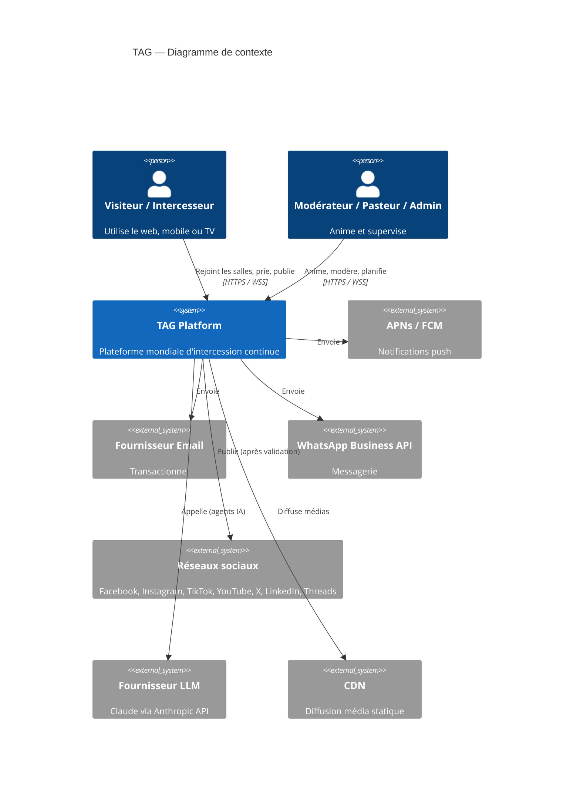
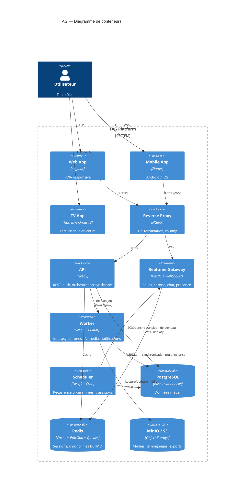
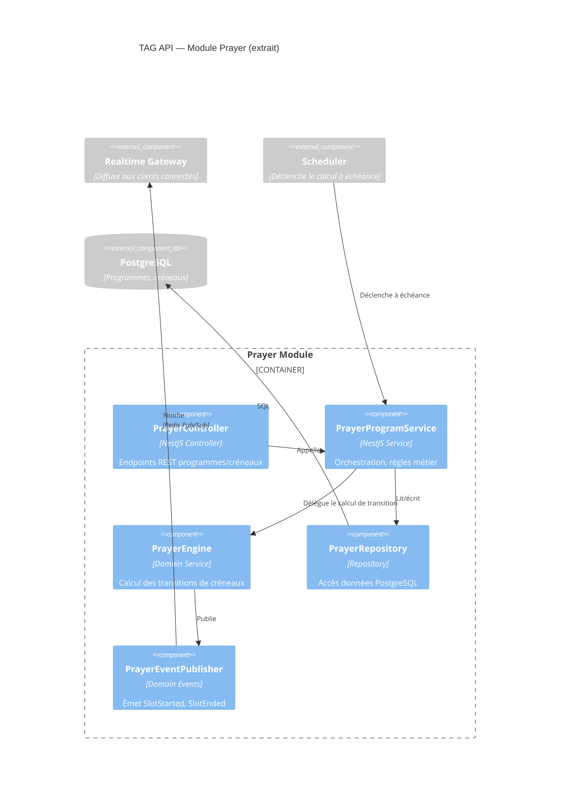
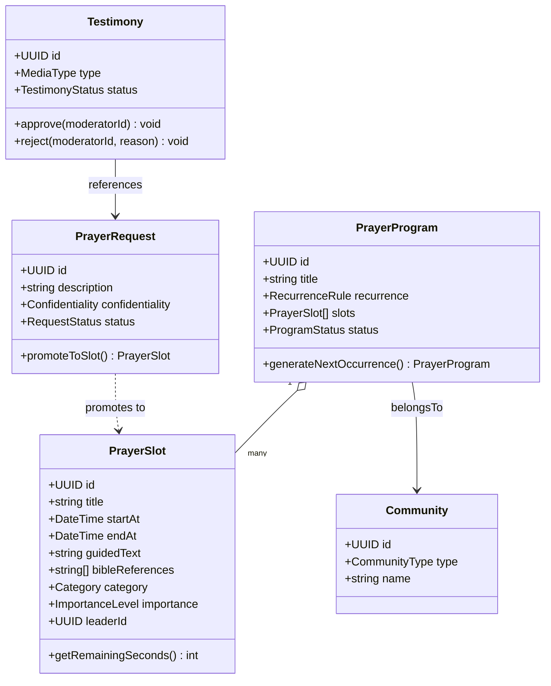
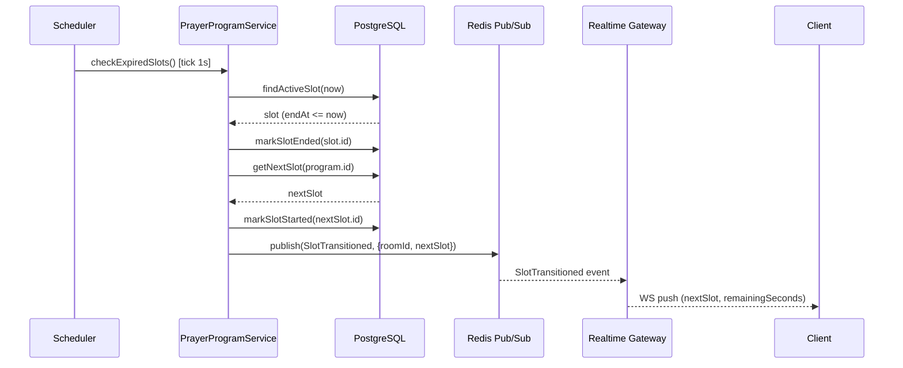
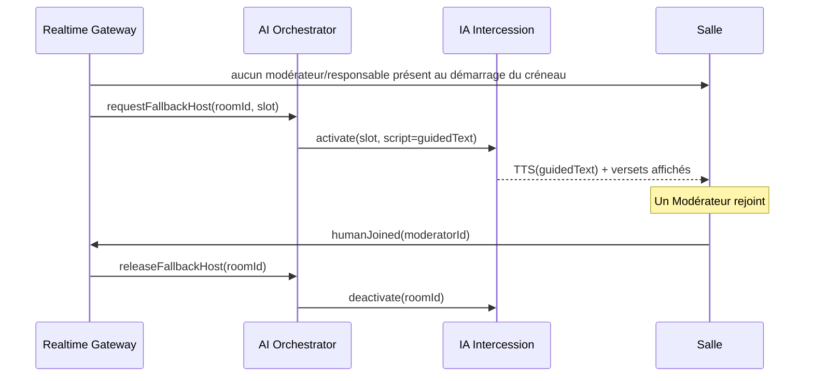

# 03_ARCHITECTURE_SPECIFICATION.md

# ARCHITECTURE SPECIFICATION

## Objectif

Décrire l'architecture logicielle cible de TAG : découpage en services, stack technologique, communication temps réel, média, scalabilité, cloud.

Toute décision ci-dessous est contraignante. Une déviation doit être documentée et validée.

---

# 1. DÉCISION D'ARCHITECTURE

## Monolithe modulaire, pas de microservices au démarrage

TAG démarre en **monolithe modulaire** (NestJS, Nx Workspace, Domain-Driven Design, un module par contexte métier — voir ordre de génération dans [[16_AI_GENERATION_RULES]] : Identity, Community, Prayer, Communication, Storage, Analytics, Administration).

Raison : la majorité de la charge (lecture de programmes, chat, notifications) ne justifie pas la complexité opérationnelle de microservices dès le MVP. Les frontières de modules (bounded contexts) sont conçues dès le départ pour permettre une extraction ultérieure sans réécriture (voir [[09_ROADMAP_AND_BACKLOG]]).

## Services déployables séparément

Même en monolithe modulaire, 4 processus sont déployés indépendamment pour permettre un scaling différencié :

API — HTTP REST, point d'entrée synchrone.

Gateway — WebSocket, temps réel (salles, chronomètre, chat, présence).

Worker — traitement asynchrone (génération IA, transcodage média, envoi notifications/emails/WhatsApp).

Scheduler — cron et planification (génération des occurrences récurrentes de programmes, transitions de créneaux, campagnes).

Ces 4 processus partagent le même code de domaine (modules Nx partagés) mais ont des points d'entrée et des profils de scaling distincts.

## Candidats à l'extraction future en microservice

IA (orchestrateur multi-agents) — forte consommation GPU/API externe, cycle de déploiement propre.

Média/Streaming — transcodage vidéo/audio, bande passante spécifique.

Voir [[09_ROADMAP_AND_BACKLOG]] pour le déclencheur d'extraction (seuils de charge).

---

# 2. DIAGRAMME DE CONTEXTE (C4 — Niveau 1)

---

# 3. DIAGRAMME DE CONTENEURS (C4 — Niveau 2)

---

# 4. DIAGRAMME DE COMPOSANTS — MODULE PRAYER (C4 — Niveau 3)

---

# 5. DIAGRAMME DE CLASSES (extrait domaine Prayer)

---

# 6. DIAGRAMME DE SÉQUENCE — TRANSITION AUTOMATIQUE DE CRÉNEAU

---

# 7. DIAGRAMME DE SÉQUENCE — BASCULE IA ANIMATRICE

---

# 8. STACK TECHNOLOGIQUE

## Backend

NestJS (TypeScript strict), Nx Workspace.

PostgreSQL — base de données relationnelle principale.

Redis — cache, pub/sub, files d'attente (BullMQ).

MinIO (S3-compatible) — stockage objet (médias, exports, pièces jointes).

## Temps réel

WebSocket (Socket.IO ou natif `ws` derrière NestJS Gateway) pour salles, chronomètre, chat, présence.

Redis Pub/Sub pour synchroniser plusieurs instances de Gateway (scalabilité horizontale).

## Audio / Vidéo / Streaming

WebRTC (SFU — ex. mediasoup ou LiveKit) pour prise de parole en direct dans les salles et événements.

Diffusion "lecture seule" à grande échelle (salle mondiale, TV) via HLS/LL-HLS derrière CDN pour supporter un nombre de spectateurs illimité sans dégrader le SFU.

## Frontend

Angular (Web/PWA) — voir [[11_COMPONENT_LIBRARY]] pour la parité des composants.

Flutter (Dart strict) — Mobile (Android/iOS) et TV connectée.

## IA

LLM : Claude (Anthropic API) comme fournisseur par défaut ; interface d'abstraction permettant un changement de fournisseur sans impact sur les agents (voir [[02_AI_AGENTS_SPECIFICATION]]).

RAG : base vectorielle (pgvector sur PostgreSQL pour limiter le nombre de systèmes à opérer) contenant Bible, corpus doctrinal, témoignages, base de connaissance.

TTS/STT : fournisseur externe spécialisé, abstrait derrière une interface interne.

## Authentification

JWT + Refresh Token rotatif (voir [[12_SECURITY_SPECIFICATION]]).

## Observabilité

Prometheus (métriques), Grafana (dashboards), Loki (logs), Tempo (traces) — voir [[15_DEVOPS_SPECIFICATION]].

## Reverse proxy / edge

NGINX (TLS termination, routage HTTP + WS).

CDN pour assets statiques et diffusion HLS.

---

# 9. SCALABILITÉ ET DISPONIBILITÉ MONDIALE

Déploiement multi-région : au moins 2 régions actives (ex. Europe + Amérique du Nord) pour couvrir la continuité 24/7 avec une latence acceptable partout.

Base de données : PostgreSQL primaire par région avec réplication en lecture ; écritures critiques (transitions de créneau, RBAC) centralisées par salle mondiale officielle pour éviter les conflits multi-maîtres.

Gateway WebSocket : stateless au niveau applicatif, état de présence et de chronomètre partagé via Redis, permettant un scaling horizontal derrière un load balancer avec affinité de session minimale.

Objectif de disponibilité et détail des exigences non fonctionnelles : voir [[08_NON_FUNCTIONAL_REQUIREMENTS]].

## Cache

Redis pour : session utilisateur, état du créneau courant par salle, compteurs de présence, résultats d'agrégation (carte mondiale) rafraîchis à intervalle court (ex. 5 s) plutôt que recalculés à chaque requête.

## Gestion des médias

Upload direct vers MinIO/S3 via URL pré-signée (le backend ne relaie jamais le flux binaire des gros fichiers).

Pipeline asynchrone (Worker) : scan antivirus, transcodage, génération de vignettes, avant passage à l'état `AVAILABLE` (voir [[10_STATE_MACHINES]] — agrégat FILE).

## Messagerie temps réel inter-services

Redis Pub/Sub pour la diffusion d'événements à faible latence (transition de créneau, présence).

BullMQ (sur Redis) pour les jobs différables (email, WhatsApp, génération IA différée, transcodage).

---

# OBJECTIF

L'architecture doit permettre d'ajouter une nouvelle salle régionale ou une nouvelle langue sans modification du code, uniquement par configuration et données.
