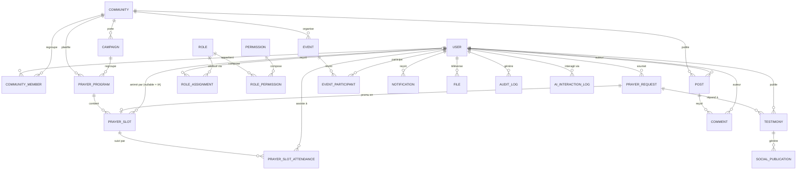

# 04_DATABASE_SPECIFICATION.md

# DATABASE SPECIFICATION

## Objectif

Définir le modèle de données complet de TAG : entités, relations, index, rétention.

Moteur : PostgreSQL. Extension `pgvector` activée pour le RAG (voir [[02_AI_AGENTS_SPECIFICATION]], [[03_ARCHITECTURE_SPECIFICATION]]).

Toute table métier hérite des colonnes communes : `id UUID PK`, `created_at`, `updated_at`, `deleted_at NULL` (soft delete), `created_by`, `updated_by`.

---

# 1. MODÈLE ENTITÉ-RELATION (ERD)

---

# 2. DOMAINE IDENTITY

## `users`

`id`, `email` (unique), `phone`, `password_hash` (Argon2id), `display_name`, `avatar_file_id`, `locale`, `timezone`, `status` (voir [[10_STATE_MACHINES]]), `mfa_enabled`.

Index : `email` (unique), `status`, `created_at`.

## `roles`, `permissions`, `role_permissions`, `role_assignments`

`roles(id, code, label)` — Visiteur, NouveauConverti, Intercesseur, Modérateur, ResponsableÉquipe, Pasteur, Administrateur, SuperAdministrateur.

`permissions(id, code)` — permission atomique, ex. `prayer_program.create`, `testimony.approve`.

`role_permissions(role_id, permission_id)`.

`role_assignments(user_id, role_id, community_id NULL)` — un rôle peut être global ou scopé à une communauté (ex. Modérateur d'une cellule précise). Détail : voir [[06_RBAC_SPECIFICATION]].

Index : `role_assignments(user_id, community_id)`.

---

# 3. DOMAINE COMMUNITY

## `communities`

`id`, `type` (`GROUP`, `TEAM`, `CELL`, `COUNTRY`, `CITY`, `CHURCH`, `MINISTRY`), `name`, `parent_id NULL` (hiérarchie, ex. Cellule → Église → Pays), `language`, `timezone`.

Index : `type`, `parent_id`.

## `community_members`

`community_id`, `user_id`, `internal_role` (libre, ex. "Trésorier"), `joined_at`.

Contrainte unique : `(community_id, user_id)`.

## `posts`, `comments`

`posts(id, community_id, author_id, content, status)` — cycle de vie voir [[10_STATE_MACHINES]].

`comments(id, post_id, author_id, content, status)`.

Index : `posts(community_id, created_at DESC)`, `comments(post_id, created_at)`.

---

# 4. DOMAINE PRAYER

## `prayer_programs`

`id`, `community_id NULL` (NULL = programme mondial officiel), `title`, `recurrence_rule` (RRULE ou équivalent structuré), `status` (voir [[10_STATE_MACHINES]] — `CAMPAIGN`/programme).

## `prayer_slots`

`id`, `program_id`, `order_index`, `title`, `category` (Famille, Finances, Santé, Guérison, Évangélisation, Nation, Jeunesse, Mariage, Église, Mission, Urgence, Autre), `importance`, `start_at`, `end_at`, `guided_text`, `bible_references` (jsonb array), `recommended_songs` (jsonb array), `leader_user_id NULL` (NULL = IA Intercession), `status`.

Index : `prayer_slots(program_id, order_index)`, `prayer_slots(status, end_at)` — critique pour le job de transition (voir [[03_ARCHITECTURE_SPECIFICATION]] section 6).

## `prayer_slot_attendance`

`slot_id`, `user_id`, `joined_at`, `left_at NULL`.

Index : `(slot_id, user_id)` unique, `(user_id, joined_at)` pour les statistiques personnelles.

## `prayer_requests`

`id`, `author_id NULL` (NULL si anonyme), `category`, `description`, `photo_file_id NULL`, `attachment_file_id NULL`, `confidentiality` (`ANONYMOUS`, `PRIVATE`, `PUBLIC`), `status` (voir [[10_STATE_MACHINES]]), `promoted_slot_id NULL`.

Index : `status`, `category`, `created_at`.

## `testimonies`

`id`, `author_id`, `related_request_id NULL`, `media_type` (`TEXT`, `AUDIO`, `VIDEO`, `PHOTO`), `content`/`file_id`, `status` (`DRAFT`, `PUBLISHED`, `EDITED`, `ARCHIVED` — aligné `POST`), `moderated_by NULL`, `moderation_reason NULL`.

Index : `status`, `created_at`.

## `campaigns`

`id`, `community_id NULL`, `title`, `status` (voir [[10_STATE_MACHINES]]), `start_date`, `end_date`.

---

# 5. DOMAINE EVENTS

## `events`

`id`, `community_id NULL`, `type` (Veillée, Jeûne, Croisade, Conférence, Étude biblique, Débat biblique, Formation, Intercession spéciale), `title`, `scheduled_at`, `status` (aligné `PRAYER SESSION`, voir [[10_STATE_MACHINES]]).

## `event_participants`

`event_id`, `user_id`, `role_in_event` (`ATTENDEE`, `SPEAKER`, `MODERATOR`), `hand_raised_at NULL`.

Index : `(event_id, user_id)` unique.

---

# 6. DOMAINE COMMUNICATION

## `notifications`

`id`, `user_id`, `type`, `payload` (jsonb), `status` (voir [[10_STATE_MACHINES]]), `read_at NULL`.

Index : `(user_id, status, created_at)`.

## `emails`, `whatsapp_messages`

Mêmes principes, cycles de vie propres (voir [[10_STATE_MACHINES]]).

## `social_publications`

`id`, `testimony_id NULL`, `channel` (Facebook, Instagram, TikTok, YouTube, X, LinkedIn, Threads), `draft_content`, `status` (`DRAFT`, `PENDING_APPROVAL`, `APPROVED`, `PUBLISHED`, `REJECTED`), `approved_by NULL`, `published_at NULL`.

---

# 7. DOMAINE STORAGE

## `files`

`id`, `owner_id`, `bucket_key`, `mime_type`, `size_bytes`, `status` (voir [[10_STATE_MACHINES]] — `FILE`), `scan_result NULL`.

Index : `owner_id`, `status`.

---

# 8. DOMAINE ANALYTICS / AI

## `ai_interaction_logs`

`id`, `user_id NULL`, `agent` (`ACCUEIL`, `INTERCESSION`, `EVANGELISATION`, `MODERATION`, `COMMUNICATION`, `ANALYSE`), `input_summary`, `output_summary`, `rag_sources` (jsonb array — traçabilité, voir [[02_AI_AGENTS_SPECIFICATION]]), `escalated_to_human BOOLEAN`.

Index : `(agent, created_at)`.

## `audit_logs`

`id`, `actor_id NULL` (NULL = système/IA), `action`, `entity_type`, `entity_id`, `before` (jsonb NULL), `after` (jsonb NULL), `ip`, `user_agent`, `trace_id`.

Index : `(entity_type, entity_id)`, `(actor_id, created_at)`.

Append-only : aucune mise à jour ni suppression autorisée sur cette table (voir [[12_SECURITY_SPECIFICATION]]).

## `backups`, `exports`

Cycles de vie voir [[10_STATE_MACHINES]]. `exports(id, requested_by, scope, status, download_url NULL, expires_at)`.

---

# 9. INDEX — RÉCAPITULATIF DES INDEX CRITIQUES

`prayer_slots(status, end_at)` — moteur de transition temps réel.

`prayer_requests(status, category)` — file de modération.

`notifications(user_id, status, created_at)` — pagination boîte de notifications.

`audit_logs(entity_type, entity_id)` — reconstitution d'historique.

`community_members(community_id, user_id)` unique — appartenance.

Index vectoriel (`pgvector`, `ivfflat` ou `hnsw`) sur la table `rag_documents(embedding)` pour la recherche sémantique du RAG.

---

# 10. RÉTENTION ET ARCHIVAGE

Alignée sur [[15_DEVOPS_SPECIFICATION]] (7 / 30 / 90 / 365 jours selon la criticité).

`audit_logs` : conservation minimale 365 jours, jamais de suppression physique avant export légal.

`notifications`, `emails`, `whatsapp_messages` : archivage à 90 jours, purge physique à 365 jours.

`prayer_slot_attendance` : agrégée mensuellement pour les statistiques (`ai_interaction`/analytics), détail brut purgé à 365 jours.

`files` à l'état `DELETED` : purge physique du stockage objet après 30 jours de rétention de sécurité.

---

# OBJECTIF

Aucune requête d'affichage d'une salle active ne doit nécessiter plus d'une jointure au-delà de `prayer_slots` et `prayer_programs` — la lecture temps réel doit rester triviale à mettre en cache.
